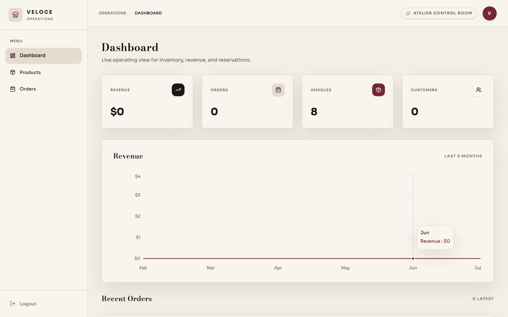
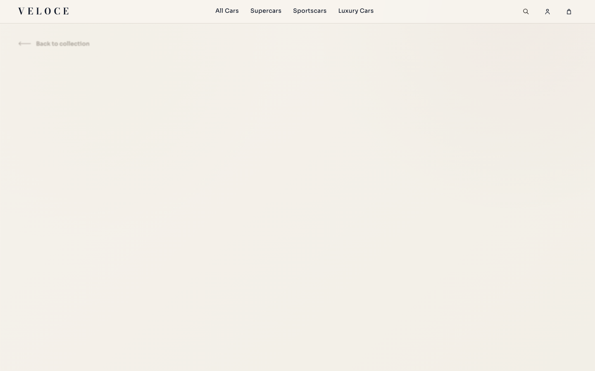
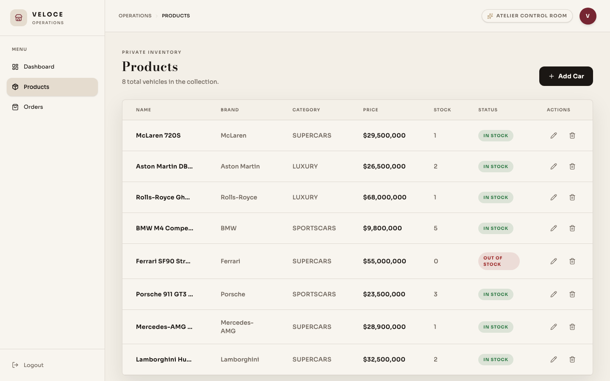
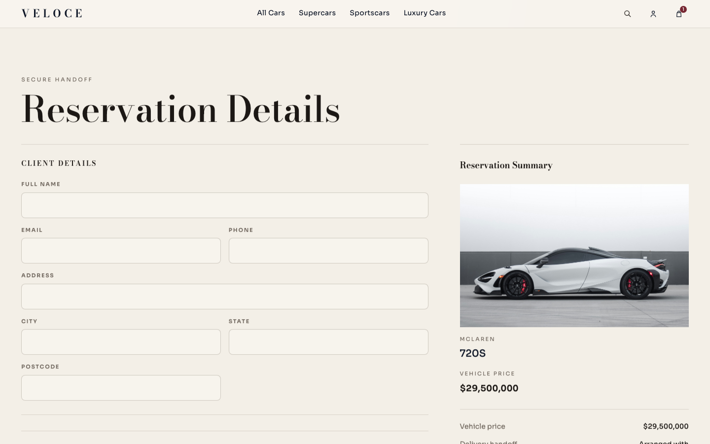

# VELOCE

A full-stack automotive commerce platform with a customer storefront, an operations dashboard, and a Spring Boot API. VELOCE demonstrates transactional order processing, role-based access, third-party payments, asynchronous notifications, caching, realtime operations updates, and automated delivery checks.

## Architecture

```text
React storefront (5173) ----+
                            +--> Spring Boot API (8080) --> PostgreSQL
React admin (5174) ---------+             |              --> Redis cache
                                          +--------------> Stripe Checkout
                                          +--------------> SMTP / Mailpit
```

## Screenshots

| Storefront | Admin |
| --- | --- |
|  |  |
|  |  |
|  | — |

## Engineering Highlights

- JWT authentication with server-enforced `CUSTOMER` and `ADMIN` authorization
- Server-side totals and pessimistic inventory locking to prevent overselling
- Stripe-hosted Checkout sessions with signed webhook payment confirmation
- Redis-backed catalog caching with cache eviction on inventory changes
- Server-Sent Events that refresh the admin order queue in realtime
- Asynchronous welcome and order-confirmation emails
- OpenAPI/Swagger documentation and Actuator health probes
- npm workspaces monorepo with a shared `@veloce/ui` design-token and component package consumed by both frontends
- JUnit 5/Mockito, Testcontainers (Postgres) integration tests, Vitest/React Testing Library, and Playwright coverage
- GitHub Actions quality gates for linting, tests, builds, and E2E tests
- Multi-stage Docker images and one-command Compose environment

## Stack

| Area | Technology |
| --- | --- |
| Storefront and admin | React 19, Vite, React Router, TanStack Query, Zustand, Tailwind CSS |
| Backend | Java 21, Spring Boot 4, Spring Security, Spring Data JPA |
| Data | PostgreSQL 16, Redis 7 |
| Integrations | Stripe Checkout, SMTP/Mailpit, SSE, OpenAPI |
| Quality | JUnit, Mockito, Vitest, React Testing Library, Playwright, GitHub Actions |

## Run Locally

Docker Compose is the supported full-stack path:

```bash
cp .env.example .env
docker compose up --build
```

- Storefront: http://localhost:5173
- Admin: http://localhost:5174
- API: http://localhost:8080
- Swagger UI: http://localhost:8080/swagger-ui.html
- Mailpit inbox: http://localhost:8025
- Health: http://localhost:8080/actuator/health

The seeded local admin is `admin@veloce.in` / `admin123`. These credentials are development-only and must be replaced before deployment.

## Optional Integrations

Email is captured locally by Mailpit. Set `MAIL_ENABLED=true` to deliver registration and order messages to it.

For Stripe sandbox checkout, add `STRIPE_SECRET_KEY` and `STRIPE_WEBHOOK_SECRET`, set `VITE_STRIPE_ENABLED=true`, then forward sandbox events:

```bash
stripe listen --forward-to localhost:8080/api/v1/payments/webhook
```

Without Stripe credentials, checkout remains a working reservation flow and records a pending order.

## Quality Commands

Frontend installs are managed as npm workspaces from the repository root — run `npm ci` once at the root, then target either app with `--workspace`:

```bash
# install once for both apps + the shared @veloce/ui package
npm ci

# storefront
npm run lint --workspace=apps/storefront
npm test --workspace=apps/storefront
npm run build --workspace=apps/storefront
npm run test:e2e --workspace=apps/storefront

# admin
npm run lint --workspace=apps/admin
npm test --workspace=apps/admin
npm run build --workspace=apps/admin

# backend (the Testcontainers integration test needs Docker running)
cd backend/api && ./mvnw verify
```

### Regenerating Screenshots

The gallery above is captured with Playwright against a running Docker Compose stack:

```bash
docker compose up --build -d
npm run screenshots --workspace=apps/storefront
```

This writes PNGs to `docs/screenshots/`. It's tagged `@screenshots` and excluded from the regular `test:e2e` / CI run.

## Security Notes

- Prices and roles are never trusted from clients.
- Admin inventory and order endpoints are protected by backend RBAC.
- Stripe webhook signatures are verified before payment state changes.
- Secrets and allowed origins are environment-configured.
- Local JWT and database defaults exist only for developer convenience; use generated secrets and managed credentials in deployment.

## Repository Layout

```text
apps/storefront/  Customer application
apps/admin/       Operations application
packages/ui/      Shared design tokens, components, and utils (@veloce/ui)
backend/api/      Spring Boot REST API
.github/workflows Continuous integration
```
