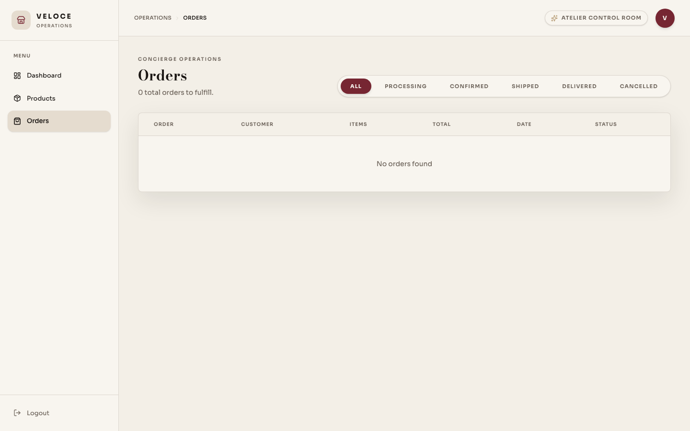
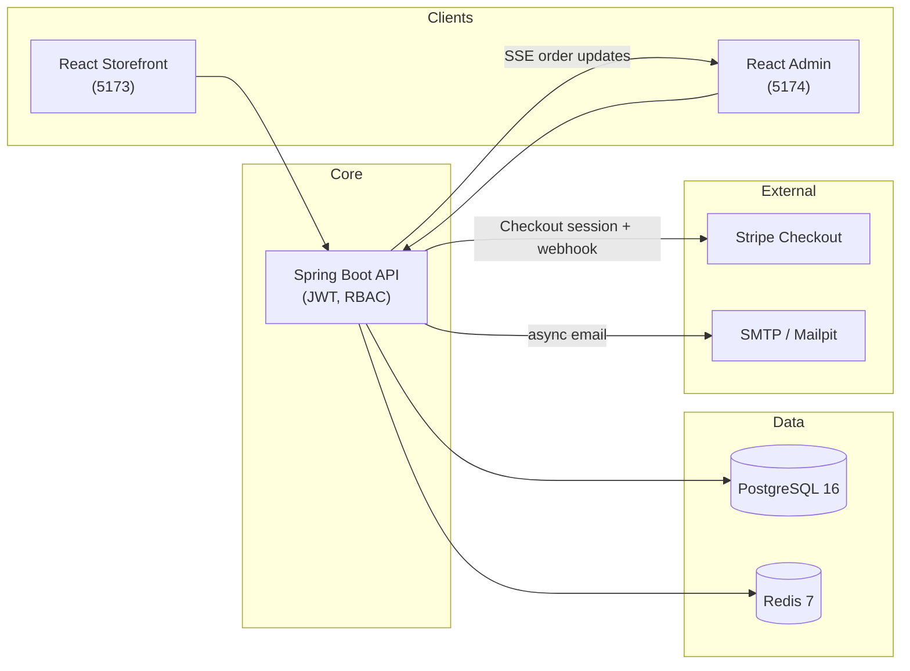

<div align="center">


# 🏎️ VELOCE

**A full-stack automotive commerce platform** — customer storefront, an operations
dashboard and a Spring Boot API, backed by real payments, realtime order tracking and
role-based access control.

[](https://github.com/anshkataria/store/actions/workflows/ci.yml)


</div>

---

## What is this?

Veloce is a two-frontend, one-backend commerce platform for buying cars. A React
storefront handles browsing, checkout and order tracking for customers; a separate React
admin app handles inventory and order management for staff; both talk to a single Spring
Boot API backed by PostgreSQL and Redis.

It's built the way a production system would be: JWT auth with server-enforced roles,
pessimistic inventory locking, Stripe-hosted checkout with signature-verified webhooks,
Redis-backed catalog caching, Server-Sent Events for realtime order updates, async
email notifications, and a full test pyramid (JUnit/Mockito/Testcontainers, Vitest,
Playwright) running in CI.

## ✨ Features

| App | What it does |
| --- | --- |
| **Storefront** | Browse and search the catalog, cart, Stripe-hosted checkout, order history and tracking |
| **Admin** | Inventory CRUD, live order queue via SSE, order status management, dashboard metrics |
| **API** | JWT auth (`CUSTOMER` / `ADMIN`), server-priced orders, inventory locking, Stripe webhooks, async email, Redis caching |

## 📸 Screenshots

<table>
<tr>
<td width="50%"><p align="center"><em>Storefront Home</em></p></td>
<td width="50%"><p align="center"><em>Product Detail</em></p></td>
</tr>
<tr>
<td width="50%"><p align="center"><em>Checkout</em></p></td>
<td width="50%"><p align="center"><em>Admin Dashboard</em></p></td>
</tr>
<tr>
<td width="50%"><p align="center"><em>Admin — Inventory</em></p></td>
<td width="50%"><p align="center"><em>Admin — Orders</em></p></td>
</tr>
</table>

## 🏗️ Architecture



Prices, roles and inventory are never trusted from the client — every write is
re-validated and priced server-side. Admin-only endpoints are protected by Spring
Security RBAC, and Stripe webhook signatures are verified before any payment state
changes.

## 🧰 Tech stack

| Layer | Stack |
| --- | --- |
| **Storefront & admin** | React 19, Vite, React Router, TanStack Query, Zustand, Tailwind CSS |
| **Backend** | Java 21, Spring Boot 4, Spring Security, Spring Data JPA |
| **Data** | PostgreSQL 16, Redis 7 |
| **Integrations** | Stripe Checkout, SMTP/Mailpit, Server-Sent Events, OpenAPI/Swagger |
| **Quality** | JUnit 5, Mockito, Testcontainers, Vitest, React Testing Library, Playwright |
| **Infra** | npm workspaces monorepo, shared `@veloce/ui` package, multi-stage Docker images, GitHub Actions CI |

## 🚀 Getting started

**Prerequisites:** Docker, Docker Compose

```bash
git clone https://github.com/anshkataria/store.git veloce
cd veloce

cp .env.example .env
# replace POSTGRES_PASSWORD and JWT_SECRET with real values before deploying

docker compose up --build
```

- Storefront: <http://localhost:5173>
- Admin: <http://localhost:5174>
- API: <http://localhost:8080>
- Swagger UI: <http://localhost:8080/swagger-ui.html>
- Mailpit inbox: <http://localhost:8025>
- Health: <http://localhost:8080/actuator/health>

The seeded local admin is `admin@veloce.in` / `admin123` — development-only, replace
before deployment.

### Optional integrations

Email is captured locally by Mailpit; set `MAIL_ENABLED=true` to deliver registration
and order messages to it.

For Stripe sandbox checkout, add `STRIPE_SECRET_KEY` and `STRIPE_WEBHOOK_SECRET`, set
`VITE_STRIPE_ENABLED=true`, then forward sandbox events:

```bash
stripe listen --forward-to localhost:8080/api/v1/payments/webhook
```

Without Stripe credentials, checkout still runs as a working reservation flow and
records a pending order.

## 📁 Project structure

```text
veloce/
├── apps/storefront/  Customer application (React)
├── apps/admin/       Operations application (React)
├── packages/ui/      Shared design tokens, components & utils (@veloce/ui)
├── backend/api/      Spring Boot REST API
├── docs/             Screenshots & docs
└── .github/workflows Continuous integration
```

## 🧪 Testing & CI

Every push lints, tests and builds both frontends, runs the Spring Boot test suite
(Testcontainers-backed integration tests included), and runs a Playwright E2E suite
against the storefront.

Frontend installs are managed as npm workspaces from the repo root:

```bash
# install once for both apps + the shared @veloce/ui package
npm ci

# storefront
npm run lint --workspace=apps/storefront
npm test --workspace=apps/storefront
npm run build --workspace=apps/storefront
npm run test:e2e --workspace=apps/storefront

# admin
npm run lint --workspace=apps/admin
npm test --workspace=apps/admin
npm run build --workspace=apps/admin

# backend (needs Docker running for the Testcontainers integration test)
cd backend/api && ./mvnw verify
```

### Regenerating screenshots

The gallery above is captured with Playwright against a running Docker Compose stack:

```bash
docker compose up --build -d
npm run screenshots --workspace=apps/storefront
```

This writes PNGs to `docs/screenshots/`. It's tagged `@screenshots` and excluded from
the regular `test:e2e` / CI run.

## 🔐 Security notes

- Prices and roles are never trusted from clients.
- Admin inventory and order endpoints are protected by backend RBAC.
- Stripe webhook signatures are verified before payment state changes.
- Secrets and allowed origins are environment-configured.
- Local JWT and database defaults exist only for developer convenience; use generated
  secrets and managed credentials in deployment.
